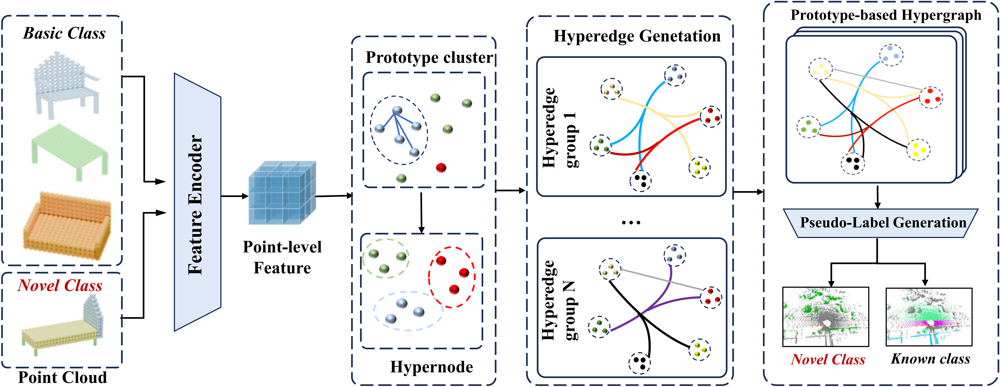

# Geometric-Aware Hypergraph Reasoning for Novel Class Discovery in Point Cloud Segmentation

📄 **CVPR 2026 ( Accepted)**

[Paper]

## Overview

Novel Class Discovery (NCD) in point cloud segmentation aims to automatically identify and segment **unlabeled novel categories** by transferring knowledge from known classes. Existing approaches mainly rely on **pairwise associations**, which limits their capability to model complex inter-class relationships.

We propose **GAHR (Geometric-Aware Hypergraph Reasoning)**, a novel framework that introduces **high-order relational reasoning** into 3D Novel Class Discovery. Instead of modeling binary relations, GAHR constructs a **prototype-based hypergraph** that enables collaborative reasoning among multiple known classes for discovering unseen categories.

As illustrated in Figure 2, point cloud features are first transformed into **Geometric-Aware Prototypes**, which serve as hypergraph nodes. Hyperedges dynamically connect related prototypes according to geometric and semantic similarities, allowing high-order knowledge propagation for robust novel class inference. CVPR2026 (41)

------

<p align="center">    </p> <p align="center"> <b>Figure 2.</b> Overall architecture of GAHR. Point cloud features are clustered into geometric-aware prototypes, which form nodes in a dynamically updated hypergraph for collaborative novel class reasoning. </p>

## Installation

Please refer to the environment setup of **[NOPS](https://github.com/LuigiRiz/NOPS/tree/main)** for dependency installation (e.g., MinkowskiEngine, CUDA, PyTorch, etc.).

 Our implementation follows the same backbone and training pipeline, adopting MinkowskiUNet-34C with theAdamW optimizer and a multi-step learning rate schedule.

## Data preparation

 Please follow the official instructions from SemanticKITTI and SemanticPOSS to download the data. Afterward, structure the folders as follows (the root path should match the `path_to_data_shown_in_yaml_config` in your yaml config file):

```
./
├── configs/
├── scripts/
├── train.py
├── test.py
└── path_to_data_shown_in_yaml_config/
      └── sequences
            ├── 00/
            │   ├── velodyne/
            │   │     ├── 000000.bin
            │   │     ├── 000001.bin
            │   │     └── ...
            │   └── labels/
            │         ├── 000000.label
            │         ├── 000001.label
            │         └── ...
            ├── 01/
            └── ...
```

## Commands

### Train

```
python train.py -s 00 --dataset SemanticPOSS --offline --epoch 10 --use_scheduler --lam 1 --lam_region 1 --gamma 1 --alpha 1 --gamma_decrease 0.5 --smooth_bound 10 --ak_bound 0.005 --dbscan 0.5
```

```
python train.py -s 00 --dataset SemanticKITTI --offline --epoch 10 --use_scheduler --lam 1 --lam_region 1 --gamma 1 --alpha 1 --gamma_decrease 0.5 --smooth_bound 10 --ak_bound 0.005 --dbscan 0.5
```

## Citation

 If you find our work useful, please cite our paper:

```
@inproceedings{GAHR2026,
  title={Geometric-Aware Hypergraph Reasoning for Novel Class Discovery in Point Cloud Segmentation},
  author={Anonymous},
  booktitle={Proceedings of the IEEE/CVF Conference on Computer Vision and Pattern Recognition},
  year={2026}
}
```